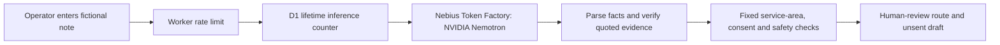

# Exception Desk — live fictional demo

A fictional service-enquiry handoff for the Nebius × NVIDIA Global AI Hackathon. A Nebius Token Factory model extracts facts and source evidence; deterministic checks decide whether a case needs safety escalation, clarification, or human review. The app never sends a reply or creates a booking. No real customer data or measured business outcomes are included.

**Status:** The [hosted demo](https://impactlayer-exception-desk.impactlayer.workers.dev/) made verified model-backed analyses through Nebius Token Factory on 29 September 2026: a fictional gas concern was escalated to a person, and a fictional dripping tap was routed for clarification. The model's suggestion is labelled untrusted and never sent. A [recorded fictional safety run](https://impactlayer-exception-desk.impactlayer.workers.dev/?replay=safety) shows the saved live result without using another model call. The [55-second public video](https://youtu.be/fervYJ1sXSY) shows the fictional workflow. The Nebius × NVIDIA Devpost entry remains a draft pending public repository visibility and final submission.

## Run locally

Node.js 20+ is required. Set `NEBIUS_API_KEY` and `NEBIUS_MODEL` in the process environment; the Playground-confirmed model routing key is `nvidia/NVIDIA-Nemotron-3-Nano-30B-A3B`. Do not put the API key in the repository or browser. Then run `npm start` and open `http://127.0.0.1:4174`. Without those settings, the UI loads but the analysis endpoint returns a clear configuration error.

`npm test` checks that urgent source text overrides a routine model classification and untrusted instructions, invented location/consent cannot clear checks, a routine case remains human-reviewed, and the Nebius adapter sends a runtime inference request without returning the test key.

The runtime app is deliberately small and dependency-free; Wrangler is a development/deployment tool. The deployed Worker holds its Nebius key as a Cloudflare secret; the key is absent from this repository and its history. This contest-specific project is released under the [MIT License](LICENSE); it does not include code from Dragon Academy, POWS or Balltrix.

## How a case moves

The model is asked to extract facts and propose a reply, not to decide whether a job is booked. Source-text safety keywords, supported towns and explicit contact consent are checked separately in `src/policy.mjs`. Model suggestions are shown as untrusted text; the app never sends them. If a live model response contains no usable JSON, extraction is marked unavailable and the source-based safety checks still run. The Worker stores only the usage counter in D1, not customer notes or model output.

## Cloudflare demo preparation

The same UI and policy logic have a Worker adapter in `src/worker.mjs`. It serves the static files, keeps the Nebius key server-side, applies a two-request-per-minute-per-IP limit, and uses a separate D1 database to cap live calls at **20 for the lifetime of the demo**, including failed attempts. The cap is stored under one durable D1 key, so it does not reset daily. The Worker runs locally with `npm run dev:worker` after `npx wrangler d1 execute exception-desk-demo --local --file=schema.sql`. Six of those attempts had been used by 29 September; one exposed an insufficient generation budget and another returned unusable JSON, prompting the bounded-output and safe-fallback fixes. Never commit a key or add one to `wrangler.jsonc`. The application-level cap is not an account-wide spending limit.

To set up a separate Cloudflare deployment, create a D1 database, replace the database ID in `wrangler.jsonc`, then run `npx wrangler d1 execute exception-desk-demo --remote --file=schema.sql`. Set `NEBIUS_MODEL` to a model confirmed in your own Token Factory account, and add `NEBIUS_API_KEY` with `npx wrangler secret put NEBIUS_API_KEY`. Run `npm test` before `npm run deploy`. Do not add a key until the account's available credit and billing controls have been checked. The public form is only for fictional data; the demo is not a live customer intake system.

Built by [ImpactLayer](https://impactlayer.co.uk/) as a fictional work sample.
